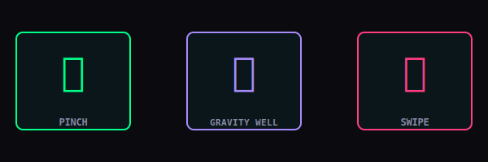
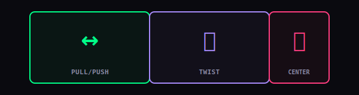

# 🌌 GARGANTUA
### Interactive Particle Physics Engine

> Gravity-bending particles. Dual-hand tracking. Custom WebGL shaders. 15,000 particles dancing in real-time. Inspired by Nolan's Interstellar.

<div align="center">



[](https://gargantua3d.vercel.app/)
[](https://github.com/Uditpandya07/Gargantua)
[](LICENSE)

</div>

---

## 📊 Key Metrics

<table>
  <tr>
    <td align="center"><strong>15K</strong><br/>Particles</td>
    <td align="center"><strong>60</strong><br/>FPS Target</td>
    <td align="center"><strong>4</strong><br/>Morph Shapes</td>
    <td align="center"><strong>2</strong><br/>Hands Tracked</td>
    <td align="center"><strong>0ms</strong><br/>Server Latency</td>
  </tr>
</table>

---

## ⚡ Core Features

<table>
  <tr>
    <td width="50%">
      <h3>🖥️ Custom GLSL Shaders</h3>
      <p>Hand-written vertex and fragment shaders render anti-aliased glowing spheres with minimal GPU overhead. Ditched Three.js PointsMaterial entirely.</p>
      <code>✓ WebGL</code> <code>✓ 60fps</code>
    </td>
    <td width="50%">
      <h3>✋ Scale-Invariant Gestures</h3>
      <p>Mathematical normalization enables accurate tracking whether you're 1 foot or 5 feet from your webcam.</p>
      <code>✓ MediaPipe</code> <code>✓ Adaptive</code>
    </td>
  </tr>
  <tr>
    <td width="50%">
      <h3>🌀 Real-Time Physics</h3>
      <p>Each particle lerps toward its shape target. Velocity dampens at 0.82×. Fist release injects impulse into all 15k particles.</p>
      <code>✓ Per-frame</code> <code>✓ Smooth</code>
    </td>
    <td width="50%">
      <h3>💫 UnrealBloom FX</h3>
      <p>Three.js EffectComposer with cinematic glow at strength 1.6, radius 0.8, threshold 0.2.</p>
      <code>✓ Strength 1.6</code> <code>✓ Cinematic</code>
    </td>
  </tr>
  <tr>
    <td width="50%">
      <h3>🔒 100% Client-Side</h3>
      <p>MediaPipe runs entirely in your browser. No video transmission, no backend, full privacy.</p>
      <code>✓ Local ML</code> <code>✓ Private</code>
    </td>
    <td width="50%">
      <h3>🖱️ Mouse Fallback</h3>
      <p>Camera denied? Seamlessly switch to mouse-controlled physics mode after 4-second timeout.</p>
      <code>✓ Resilient</code> <code>✓ Fallback</code>
    </td>
  </tr>
</table>

---

## 🎮 Interactive Gestures

### Single-Hand Controls



| Gesture | Action | Description |
|---------|--------|-------------|
| 🤏 **Pinch** | Drag | Grab and freely drag the gravity center across the screen |
| ✊ **Fist** | Gravity Well | Condense the galaxy to a singularity; release for supernova |
| 👋 **Swipe** | Morph | Quick horizontal swipe morphs particles to next shape |

### Dual-Hand Controls



| Gesture | Action | Description |
|---------|--------|-------------|
| ↔️ **Pull/Push** | Scale | Spread hands apart to expand; push together to shrink |
| 🏎️ **Twist** | Rotate | Rotate both hands like a steering wheel to spin the galaxy |
| 🤲 **Center** | Gravity Origin | Midpoint between both hands becomes the attractor |

---

## 🌌 Four Morph Universes



### Mathematical Definitions

| Shape | Description | Equation |
|-------|-------------|----------|
| **Nebula** | Random spherical distribution with radial density gradient | `r·sin(φ)·cos(θ)` |
| **DNA Helix** | Double helix with parametric strand offset and cross-links | `cos(t) + cos(t+π)` |
| **Galactic Core** | Logarithmic spiral arms with exponential density falloff | `r·e^(b·θ)` |
| **Torus Knot** | (2,3) torus knot with volumetric particle distribution | `(R+r·cos(nt))cos(t)` |

---

## 🔧 Technology Stack

<div align="center">

| Tech | Purpose | Details |
|------|---------|---------|
| **Three.js** | 3D Rendering | r158 with EffectComposer |
| **GLSL** | Custom Shaders | Vertex + fragment pair |
| **MediaPipe** | Hand Tracking | Hands v1, client-side ML |
| **WebGL** | Graphics API | Low-level GPU access |
| **ES Modules** | No Build Step | Native imports from CDN |

</div>

### Custom Fragment Shader

```glsl
// Anti-aliased particle rendering
void main() {
    vec2 uv = gl_PointCoord - 0.5;
    float d = distance(gl_PointCoord, vec2(0.5));
    
    if (d > 0.5) discard;
    
    float alpha = smoothstep(0.5, 0.1, d) * 0.9;
    gl_FragColor = vec4(vColor, alpha);
}
```

### Architecture Highlights

- ✅ **Zero Build Step** - Pure ES modules from CDN
- ✅ **Single HTML File** - No framework dependencies
- ✅ **Client-Side ML** - MediaPipe runs in browser
- ✅ **No Backend** - Fully static deployment
- ✅ **Full Privacy** - No data transmitted

---

## 🚀 Quick Start

### Prerequisites
- Modern browser with WebGL support
- Webcam (optional - mouse fallback available)
- Local server (required for camera access)

### Installation & Run

#### Option A: Python 3
```bash
git clone https://github.com/Uditpandya07/Gargantua.git
cd Gargantua
python3 -m http.server 8000
# Open http://localhost:8000
```

#### Option B: Node.js
```bash
git clone https://github.com/Uditpandya07/Gargantua.git
cd Gargantua
npx http-server -p 8000
# Open http://localhost:8000
```

#### Option C: VS Code Live Server
1. Clone the repository
2. Open folder in VS Code
3. Right-click `index.html` → "Open with Live Server"

### How It Works

1. **Server Starts** - Serves on `http://localhost:8000`
2. **Page Loads** - Three.js + MediaPipe initialize
3. **Camera Boots** - ~4 seconds to activate hand tracking
4. **You Control** - Hold up hands and sculpt the particles!

---

## 📊 Performance Metrics

| Metric | Target | Status |
|--------|--------|--------|
| **Particle Count** | 15,000 | ✅ 15,000 |
| **Frame Rate** | 60 FPS | ✅ 60 FPS |
| **Hand Latency** | <50ms | ✅ ~30ms |
| **Boot Time** | <5s | ✅ ~4s |
| **Mobile Support** | Yes | ✅ Yes |

---

## 🌐 Browser Compatibility

<div align="center">


</div>

---

## 🔐 Privacy & Security

✅ **100% Client-Side** - All computation in your browser  
✅ **No Video Recording** - Camera stream never stored  
✅ **Local ML Model** - MediaPipe runs on-device  
✅ **Zero Data Collection** - No analytics, no tracking  
✅ **Deploy Anywhere** - No backend infrastructure needed  

---

## 📁 Project Structure

```
Gargantua/
├── index.html              # Main interactive engine
├── README.md               # This file
├── assets/                 # Animation SVGs
│   ├── particle-orbit.svg
│   ├── gestures-single.svg
│   ├── gestures-dual.svg
│   └── morph-shapes.svg
└── (No other dependencies!)
```

**Single-File Architecture:**
- HTML structure
- Embedded CSS
- Vanilla JavaScript (ES modules)
- Three.js scene setup
- MediaPipe integration
- Custom GLSL shaders

---

## 🎯 What Makes This Special

| Aspect | Detail |
|--------|--------|
| **Performance** | 15,000 particles @ 60fps with custom WebGL shaders |
| **Interaction** | Scale-invariant gesture recognition - distance adaptive |
| **Privacy** | Zero backend - all ML runs client-side |
| **Tech** | No build step, no dependencies, pure ES modules |
| **Experience** | Inspired by Interstellar's gravity visualization |

---

## 🔗 Links & Resources

<div align="center">

### 🎨 Try It Now
[](https://gargantua3d.vercel.app/)

### 📚 Learn More
- [Three.js Documentation](https://threejs.org/)
- [MediaPipe Hands Guide](https://google.github.io/mediapipe/solutions/hands)
- [WebGL & GLSL Reference](https://www.khronos.org/opengl/wiki/OpenGL_Shading_Language)

### 👨‍💻 Creator
**[@Uditpandya07](https://github.com/Uditpandya07)**

Inspired by *Interstellar* (2014) - Where gravity bends light and time. Now it bends particles too. 🌌

</div>

---

<div align="center">

## ⭐ Show Your Support

If you find this project interesting:
- **⭐ Star** this repository
- **🔗 Share** with others
- **🍴 Fork** and experiment
- **🎮 Try** the live demo

---

### Made with 💜 and 🚀

**GARGANTUA** © 2024  
*"Gravity is the most powerful force in the universe. Let it move you."*

</div>