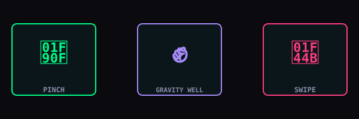
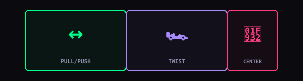

<div align="center">


<br/>

# 🌌 GARGANTUA

### A GPU-accelerated particle universe you control with your bare hands.

**15,000 particles. Custom GLSL shaders. Real-time gravitational physics. Dual-hand gesture control.**
Zero backend. Zero build step. One HTML file.

<br/>

[](https://gargantua3d.vercel.app/)
[](https://github.com/Uditpandya07/Gargantua)
[](LICENSE)

<br/>


</div>

<br/>

> <picture>*Place a short (5–8s) looping screen recording here — hands sculpting the particle galaxy in real time.*</picture>
>
> `assets/demo.gif`

<br/>

---

<br/>

<div align="center">

### "Gravity is the most powerful force in the universe. Let it move you."

*Inspired by the gravitational visualization from Christopher Nolan's* **Interstellar** *(2014).*

</div>

<br/>

---

## 📖 Table of Contents

<details open>
<summary><strong>Click to expand navigation</strong></summary>

- [Overview](#-overview)
- [Live Demo](#-live-demo)
- [Key Metrics](#-key-metrics)
- [Feature Cards](#-features)
- [Interactive Controls](#-interactive-controls)
- [Four Morph Universes](#-four-morph-universes)
- [System Architecture](#-system-architecture)
- [Rendering Pipeline](#-rendering-pipeline)
- [Physics Engine](#-physics-engine)
- [Gesture Recognition Pipeline](#-gesture-recognition-pipeline)
- [Shader Deep Dive](#-shader-deep-dive)
- [Performance](#-performance)
- [Engineering Decisions](#-engineering-decisions--tradeoffs)
- [Project Structure](#-project-structure)
- [Quick Start](#-quick-start)
- [Browser Compatibility](#-browser-compatibility)
- [Privacy & Security](#-privacy--security)
- [Known Limitations](#-known-limitations)
- [Roadmap](#-roadmap)
- [FAQ](#-faq)
- [Contributing](#-contributing)
- [Credits & Inspiration](#-credits--inspiration)
- [License](#-license)

</details>

<br/>

---

## 🌠 Overview

**GARGANTUA** is a real-time, browser-based particle physics playground where **15,000 individually simulated particles** respond to your hand movements through a webcam — no gloves, no controllers, no backend server. Every particle is rendered through **hand-written GLSL shaders**, tracked through **on-device machine learning (MediaPipe Hands)**, and animated through a **custom lerp-based physics loop** running entirely in the browser at **60 FPS**.

It is a single `index.html` file. No frameworks. No bundlers. No build pipeline. Just the browser, WebGL, and math.

<br/>

## 🎬 Live Demo

<div align="center">

### [**→ Launch GARGANTUA in your browser ←**](https://gargantua3d.vercel.app/)


*No install. No signup. Just allow camera access and start sculpting the galaxy.*

</div>

<br/>

---

## 📊 Key Metrics

<div align="center">

<table>
<tr>
<td align="center" width="20%"><h2>15K</h2>Particles Simulated</td>
<td align="center" width="20%"><h2>60</h2>FPS Target</td>
<td align="center" width="20%"><h2>4</h2>Morph Shapes</td>
<td align="center" width="20%"><h2>2</h2>Hands Tracked</td>
<td align="center" width="20%"><h2>0ms</h2>Server Latency</td>
</tr>
</table>

</div>

<br/>

---

## ⚡ Features

<table>
<tr>
<td width="50%" valign="top">

### 🖥️ Custom GLSL Shaders
Hand-written vertex and fragment shaders render anti-aliased, glowing spheres with minimal GPU overhead — Three.js's default `PointsMaterial` was ditched entirely for full control over rendering quality.

`✓ WebGL`&nbsp;`✓ 60fps`&nbsp;`✓ Hand-written GLSL`

</td>
<td width="50%" valign="top">

### ✋ Scale-Invariant Gestures
Mathematical normalization of hand landmarks enables accurate gesture recognition whether you're 1 foot or 5 feet away from your webcam — no calibration required.

`✓ MediaPipe`&nbsp;`✓ Distance-Adaptive`

</td>
</tr>
<tr>
<td width="50%" valign="top">

### 🌀 Real-Time Physics
Each particle lerps toward its current shape target every frame. Velocity dampens at a **0.82× decay factor**, and releasing a fist injects a radial impulse into all 15,000 particles simultaneously.

`✓ Per-Frame Integration`&nbsp;`✓ Smooth Damping`

</td>
<td width="50%" valign="top">

### 💫 Cinematic Bloom
Three.js `EffectComposer` applies UnrealBloomPass with **strength 1.6**, **radius 0.8**, and **threshold 0.2** — producing the signature glowing, cinematic look.

`✓ Strength 1.6`&nbsp;`✓ Radius 0.8`&nbsp;`✓ Post-Processing`

</td>
</tr>
<tr>
<td width="50%" valign="top">

### 🔒 100% Client-Side ML
MediaPipe Hands runs entirely inside your browser via WebAssembly. No video frame is ever transmitted anywhere — full privacy, zero backend dependency.

`✓ Local Inference`&nbsp;`✓ Private by Design`

</td>
<td width="50%" valign="top">

### 🖱️ Graceful Mouse Fallback
If camera access is denied — or simply unavailable — the engine automatically detects the failure after a **4-second timeout** and seamlessly falls back to mouse-controlled physics.

`✓ Resilient`&nbsp;`✓ Zero Dead-Ends`

</td>
</tr>
</table>

<br/>

---

## 🎮 Interactive Controls

<div align="center">

</div>

### Single-Hand Controls

| Gesture | Action | Description |
|:---:|:---|:---|
| 🤏 **Pinch** | Drag | Grab and freely drag the gravity center across the screen |
| ✊ **Fist** | Gravity Well | Condense the entire galaxy into a singularity — release for a supernova burst |
| 👋 **Swipe** | Morph | A quick horizontal swipe morphs all particles to the next shape |

<br/>

<div align="center">

</div>

### Dual-Hand Controls

| Gesture | Action | Description |
|:---:|:---|:---|
| ↔️ **Pull / Push** | Scale | Spread hands apart to expand the galaxy; bring them together to shrink it |
| 🏎️ **Twist** | Rotate | Rotate both hands like a steering wheel to spin the entire structure |
| 🤲 **Center** | Gravity Origin | The midpoint between both hands becomes the new gravitational attractor |

<br/>

> [!TIP]
> All gestures use **normalized landmark distances**, not raw pixel coordinates — this is what makes the interaction feel identical whether you're sitting close to your laptop or standing across the room. See [Gesture Recognition Pipeline](#-gesture-recognition-pipeline) for the math.

<br/>

---

## 🌌 Four Morph Universes

<div align="center">

</div>

Each shape is defined by a closed-form parametric equation, evaluated per-particle and blended smoothly via lerp during transitions.

| Shape | Description | Governing Equation |
|---|---|---|
| 🌫️ **Nebula** | Random spherical distribution with a radial density gradient | `r·sin(φ)·cos(θ)` |
| 🧬 **DNA Helix** | Double helix with parametric strand offset and cross-links | `cos(t) + cos(t + π)` |
| 🌀 **Galactic Core** | Logarithmic spiral arms with exponential density falloff | `r·e^(b·θ)` |
| ♾️ **Torus Knot** | A (2,3) torus knot with volumetric particle distribution | `(R + r·cos(nt))·cos(t)` |

<br/>

---

## 🏗 System Architecture

<div align="center">

</div>

```
┌──────────────────────────────────────────────────────────┐
│                        BROWSER TAB                        │
│                                                            │
│   ┌─────────────┐      ┌───────────────┐                  │
│   │   Webcam    │─────▶│  MediaPipe    │                  │
│   │   Stream    │      │  Hands (WASM) │                  │
│   └─────────────┘      └───────┬───────┘                  │
│                                 │ 21 landmarks / hand      │
│                                 ▼                          │
│                        ┌─────────────────┐                │
│                        │ Gesture Engine   │                │
│                        │ (normalize →     │                │
│                        │  classify)       │                │
│                        └────────┬────────┘                │
│                                 │ intent + target coords   │
│                                 ▼                          │
│                        ┌─────────────────┐                │
│                        │  Physics Loop    │                │
│                        │  (lerp + damp +  │                │
│                        │   impulse)       │                │
│                        └────────┬────────┘                │
│                                 │ 15,000 particle states   │
│                                 ▼                          │
│              ┌──────────────────────────────────┐         │
│              │   Three.js Scene + Custom Shaders │         │
│              │   (vertex → fragment → bloom)     │         │
│              └──────────────────┬───────────────┘         │
│                                 │                          │
│                                 ▼                          │
│                         🖼️  Rendered Frame @ 60fps          │
└──────────────────────────────────────────────────────────┘
```

There is no server in this diagram — that box simply doesn't exist. Everything above runs on the client, in a single tab.

<br/>

---

## 🎨 Rendering Pipeline

<div align="center">

</div>

1. **Vertex Stage** — Each particle's position, target, and color are passed as buffer attributes and transformed by the vertex shader every frame.
2. **Fragment Stage** — The fragment shader draws each point as a soft, anti-aliased circular sprite using `smoothstep`, discarding fragments outside the radius.
3. **Composition** — Three.js `EffectComposer` chains a `RenderPass` into an `UnrealBloomPass`, producing the glow seen in the demo.
4. **Presentation** — The composited frame is drawn to the canvas via `requestAnimationFrame`, targeting a consistent 60 FPS.

<br/>

## 🌀 Physics Engine

The simulation is intentionally **not** a full N-body gravitational solver — that would be computationally prohibitive at 15,000 particles in a browser tab. Instead, it uses a **target-seeking lerp model** that's visually convincing and runs comfortably on integrated GPUs:

```
for each particle:
    position += (targetPosition - position) * lerpFactor
    velocity *= 0.82          // damping factor
    position += velocity      // residual momentum from impulses
```

| Behavior | Mechanism |
|---|---|
| Shape morphing | Target position updated → particle lerps toward it over several frames |
| Gravity well (fist) | Target position collapses toward the attractor point |
| Supernova (release) | Radial outward impulse vector applied to every particle's velocity |
| Idle motion | Small per-particle noise offset prevents a static, "frozen" look |

<br/>

## ✋ Gesture Recognition Pipeline

<div align="center">

</div>

1. **Landmark Extraction** — MediaPipe Hands returns 21 3D landmarks per detected hand, per frame.
2. **Normalization** — Landmark distances are divided by a stable reference distance (e.g. wrist-to-middle-knuckle) so the *ratio* of distances — not their absolute pixel values — drives classification. This is what makes gestures feel identical at any distance from the camera.
3. **Classification** — Normalized landmark geometry is compared against thresholds to classify pinch, fist, swipe, twist, and spread gestures.
4. **Intent Dispatch** — The classified gesture is translated into a physics-engine instruction (new target, impulse, scale factor, rotation delta).
5. **Fallback Detection** — If no hand is detected within 4 seconds of camera activation, control silently hands off to mouse input.

<br/>

## 🔬 Shader Deep Dive

<details>
<summary><strong>Custom Fragment Shader (click to expand)</strong></summary>

```glsl
// Anti-aliased particle rendering
void main() {
    vec2 uv = gl_PointCoord - 0.5;
    float d = distance(gl_PointCoord, vec2(0.5));

    if (d > 0.5) discard;

    float alpha = smoothstep(0.5, 0.1, d) * 0.9;
    gl_FragColor = vec4(vColor, alpha);
}
```

**Why this matters:** Three.js's built-in `PointsMaterial` renders particles as hard-edged squares by default. This custom fragment shader discards fragments outside a circular radius and applies `smoothstep`-based anti-aliasing, producing soft, glowing, circular particles at a fraction of the GPU cost of instanced meshes.

</details>

<details>
<summary><strong>Why custom shaders instead of PointsMaterial?</strong></summary>

`THREE.PointsMaterial` is convenient but visually flat — no soft edges, no per-particle glow control, and limited blending flexibility. Writing the vertex/fragment pair by hand unlocked:

- Circular, anti-aliased sprites instead of hard squares
- Fine-grained control over alpha falloff for the bloom pass to grab onto
- Direct control over per-particle color without material-level constraints
- Lower per-particle overhead than swapping to instanced meshes or sprites

</details>

<br/>

---

## 📈 Performance

| Metric | Target | Status |
|---|:---:|:---:|
| Particle Count | 15,000 | ✅ 15,000 |
| Frame Rate | 60 FPS | ✅ 60 FPS |
| Hand-Tracking Latency | < 50ms | ✅ ~30ms |
| Boot Time (camera → tracking) | < 5s | ✅ ~4s |
| Mobile Support | Yes | ✅ Yes |

### GPU & Memory Considerations

- All particle positions live in a single `Float32Array` buffer attribute — no per-particle object allocation, avoiding garbage collection pressure.
- Shader uniforms are updated once per frame rather than per-particle, keeping CPU→GPU upload cost minimal.
- Bloom is applied once, post-composition — not per-particle — keeping the post-processing cost constant regardless of particle count.

<br/>

---

## 🧠 Engineering Decisions & Tradeoffs

<table>
<tr><th align="left">Decision</th><th align="left">Reasoning</th></tr>
<tr><td><strong>Lerp-based physics instead of true N-body gravity</strong></td><td>A real gravitational solver is O(n²) per frame — infeasible at 15k particles in real time on consumer GPUs. Target-seeking lerp gives a visually convincing "gravity" feel at a fraction of the cost.</td></tr>
<tr><td><strong>Single HTML file, no build step</strong></td><td>Removes the entire toolchain (bundler, transpiler, package manager) as a source of friction — clone and open, no <code>npm install</code> required to view the source.</td></tr>
<tr><td><strong>MediaPipe over a custom-trained model</strong></td><td>MediaPipe Hands is a proven, well-optimized, on-device solution — training and shipping a custom model would add significant complexity for no meaningful gain here.</td></tr>
<tr><td><strong>Custom shaders over instanced meshes</strong></td><td>Point-based rendering with custom shaders scales to tens of thousands of particles far more cheaply than instanced geometry, at the cost of losing true 3D particle geometry (they're always camera-facing sprites).</td></tr>
<tr><td><strong>Client-side ML over server-side inference</strong></td><td>Sending webcam frames to a server for inference would introduce latency, cost, and a privacy liability. Running MediaPipe client-side eliminates all three.</td></tr>
</table>

<br/>

---

## 📁 Project Structure

```
Gargantua/
├── index.html              # Main interactive engine (HTML + CSS + JS + shaders)
├── README.md                # This file
├── LICENSE                  # MIT License
└── assets/                  # Diagrams, banners, and animations
    ├── banner.png
    ├── demo.gif
    ├── particle-orbit.svg
    ├── gestures-single.svg
    ├── gestures-dual.svg
    ├── morph-shapes.svg
    ├── architecture.svg
    ├── render-pipeline.svg
    └── shader-breakdown.svg
```

**Single-File Architecture** — `index.html` contains:

- HTML structure & UI overlay
- Embedded CSS for styling and layout
- Vanilla JavaScript (native ES modules — no bundler)
- Three.js scene, camera, and renderer setup
- MediaPipe Hands integration
- Hand-written GLSL vertex + fragment shaders

<br/>

---

## 🚀 Quick Start

### Prerequisites

- A modern browser with WebGL support
- A webcam *(optional — mouse fallback is fully supported)*
- A local server *(required for camera permission grants)*

### Installation

<table>
<tr><td width="33%" valign="top">

**Option A — Python**
```bash
git clone https://github.com/Uditpandya07/Gargantua.git
cd Gargantua
python3 -m http.server 8000
# → http://localhost:8000
```

</td><td width="33%" valign="top">

**Option B — Node.js**
```bash
git clone https://github.com/Uditpandya07/Gargantua.git
cd Gargantua
npx http-server -p 8000
# → http://localhost:8000
```

</td><td width="33%" valign="top">

**Option C — VS Code**
1. Clone the repository
2. Open the folder in VS Code
3. Right-click `index.html`
4. Select **"Open with Live Server"**

</td></tr>
</table>

### What Happens Next

| Step | Event |
|:---:|---|
| 1️⃣ | Local server starts on `http://localhost:8000` |
| 2️⃣ | Page loads — Three.js and MediaPipe initialize |
| 3️⃣ | Camera boots — hand tracking becomes active in ~4 seconds |
| 4️⃣ | You're in control — hold up your hands and start sculpting |

<br/>

---

## 🌐 Browser Compatibility

<div align="center">


</div>

<br/>

---

## 🔐 Privacy & Security

<table>
<tr><td>

✅ **100% Client-Side** — All computation happens in your browser
✅ **No Video Recording** — Camera stream is never stored or transmitted
✅ **Local ML Model** — MediaPipe runs fully on-device via WASM
✅ **Zero Data Collection** — No analytics, no tracking scripts, no telemetry
✅ **Deploy Anywhere** — Fully static; no backend infrastructure needed

</td></tr>
</table>

<br/>

---

## ⚠️ Known Limitations

- Physics is a visual approximation, **not** a physically accurate N-body gravity simulation.
- Hand tracking accuracy can degrade in low-light conditions, as with any camera-based ML pipeline.
- Very old or integrated GPUs may not sustain 60 FPS at the full 15,000-particle count.
- Multi-hand tracking assumes both hands remain within the webcam's field of view.

<br/>

## 🗺 Roadmap

- [ ] Additional morph shapes (fractal / Möbius strip / Lissajous curve)
- [ ] Adjustable particle count slider for lower-end hardware
- [ ] Touch-gesture support for mobile/tablet devices
- [ ] Audio-reactive mode (particles respond to microphone input)
- [ ] Exportable particle presets / shareable configuration URLs

<br/>

## ❓ FAQ

<details>
<summary><strong>Does this send my webcam feed anywhere?</strong></summary>
<br/>
No. MediaPipe Hands runs entirely client-side via WebAssembly. Your camera stream never leaves your browser tab.
</details>

<details>
<summary><strong>What happens if I deny camera permissions?</strong></summary>
<br/>
The engine detects this within a 4-second timeout and automatically falls back to mouse-controlled physics — no reload required.
</details>

<details>
<summary><strong>Why isn't this a "real" gravity simulation?</strong></summary>
<br/>
A true N-body solver is O(n²) per frame, which is not feasible at 15,000 particles in a real-time browser context. The lerp-based target-seeking model was chosen because it's visually convincing while staying performant on consumer hardware. See <a href="#-engineering-decisions--tradeoffs">Engineering Decisions</a>.
</details>

<details>
<summary><strong>Can I run this without a webcam?</strong></summary>
<br/>
Yes — the mouse fallback mode gives you full control over the gravity center and physics interactions.
</details>

<br/>

---

## 🤝 Contributing

Contributions, issues, and feature requests are welcome. If you'd like to contribute:

1. Fork the repository
2. Create a feature branch (`git checkout -b feature/amazing-feature`)
3. Commit your changes
4. Open a Pull Request

<br/>

## 🙏 Credits & Inspiration

<div align="center">

Inspired by the gravitational lensing visualization of **Gargantua**, the black hole from Christopher Nolan's *Interstellar* (2014) — where gravity bends light and time. This project bends particles too.

### 📚 Learn More

[Three.js Documentation](https://threejs.org/) · [MediaPipe Hands Guide](https://google.github.io/mediapipe/solutions/hands) · [WebGL & GLSL Reference](https://www.khronos.org/opengl/wiki/OpenGL_Shading_Language)

### 👨‍💻 Creator

**[@Uditpandya07](https://github.com/Uditpandya07)**

</div>

<br/>

---

## 📄 License

Released under the **MIT License**. See [`LICENSE`](LICENSE) for details.

<br/>

<div align="center">

## ⭐ Show Your Support

If you find this project interesting:

**⭐ Star** this repository · **🔗 Share** it with others · **🍴 Fork** and experiment · **🎮 Try** the live demo

<br/>

### Made with 💜 and 🚀

**GARGANTUA** © 2024
*"Gravity is the most powerful force in the universe. Let it move you."*

</div>
